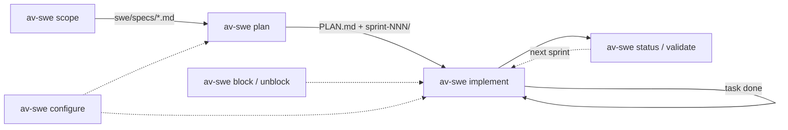
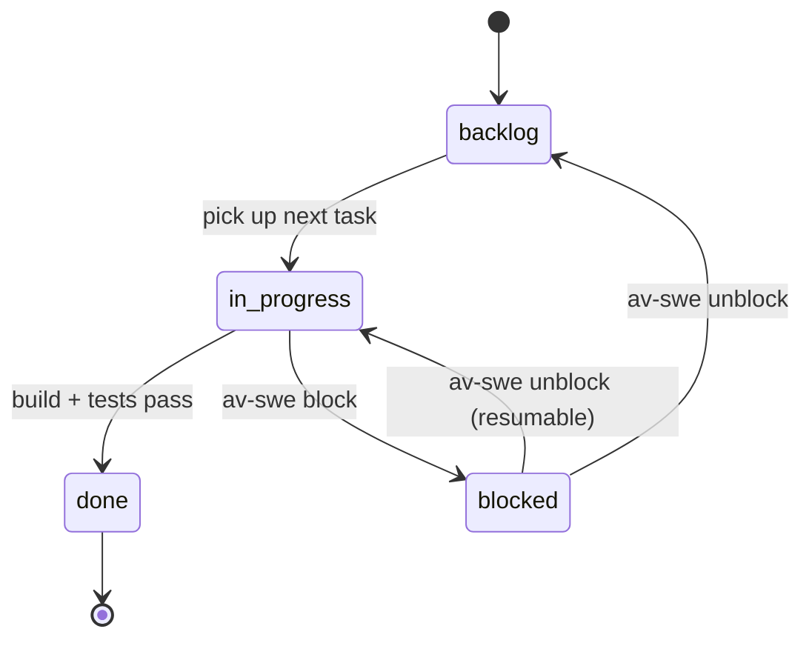

# av-swe

An [Agent Skill](https://agentskills.io) for managing a large-scale software engineering project
as a versioned, ordered, dependency-aware task plan — executed one sprint at a time through a
`backlog -> in_progress -> blocked -> done` state machine, with an auditable trail and `PLAN.md`
as the single source of truth.

The real source code is always present and in scope: specs and tasks reference it directly, and
every task is gated on your project's actual build/typecheck/lint/test commands — never a guess.



## Install

```bash
npx skills add avatsaev/av-swe-skill
```

This uses the official [`skills`](https://www.npmjs.com/package/skills) CLI (the native agent-skills
package manager, maintained by Vercel), which auto-detects your coding agent (Claude Code, Cursor,
Codex, Gemini CLI, and 70+ others) and installs the skill into its skills directory.

```bash
# Install globally, available across all projects
npx skills add avatsaev/av-swe-skill -g

# Install to a specific agent
npx skills add avatsaev/av-swe-skill -a claude-code
```

The skill is also published to the npm registry as [`av-swe`](https://www.npmjs.com/package/av-swe)
for registry-based tooling such as [`skillpm`](https://skillpm.dev):

```bash
npx skillpm install av-swe
```

## What it does

Seven operations, driven from a plan root (default `<project-root>/swe/`):

| Op | Effect |
|----|--------|
| `scope` | Capture requirements and current architecture into spec docs |
| `plan` | Derive an ordered sprint + task plan from specs/source |
| `implement` | Execute one sprint through the state machine, gated on build + test |
| `status` | Report plan health: open/in_progress/blocked/done, next sprint, gaps |
| `validate` | Check plan integrity (ordering, deps, coverage, ids) |
| `block` / `unblock` | Move a task to/from the blocked state |
| `configure` | Inspect or set project conventions |

Only `implement` writes source code — the rest produce or mutate planning artifacts.



## Usage

Once installed, the skill activates automatically when your prompt matches its description (planning
a large project, breaking work into sprints, running a sprint, checking status). You can also invoke
an op directly by name — `av-swe <op> [args]`.

### Bootstrap a new plan

```
> av-swe scope
```

Reads the existing codebase (or your stated requirements) and writes spec docs:

```
swe/specs/
  overview.md
  features/checkout.md
  architecture/persistence.md
```

```
> av-swe plan
```

Derives an ordered sprint/task breakdown from the specs (or straight from source if `scope` was
skipped):

```
swe/
  PLAN.md
  sprint-001-foundation/
    backlog/task-001-scaffold-schema.md
    backlog/task-002-wire-migrations.md
    in_progress/.gitkeep
    blocked/.gitkeep
    done/.gitkeep
```

### Run a sprint

```
> av-swe implement sprint-001
```

Works one task at a time through `backlog -> in_progress -> done`, gated on the project's real
build/typecheck/lint/test commands. Never marks a task done with a failing build; a stuck task stays
in `in_progress/` with a `## Blocker` section instead of being skipped. Writes a
`done/task-NNN-*-summary.md` audit trail per completed task. Omit the sprint argument to auto-pick
the lowest-numbered sprint that still has backlog tasks.

### Check progress

```
> av-swe status
```

```
sprint-001-foundation: goal "stand up persistence layer"
  backlog: 3   in_progress: 1   blocked: 0   done: 4
Next sprint to run: sprint-001-foundation
in_progress: task-005-add-index-migration
```

```
> av-swe validate
```

Checks sprint/task ordering, dependency direction, id uniqueness, and spec coverage; run before
`implement` to catch a mis-planned dependency early.

### Handle a blocker

```
> av-swe block sprint-001/task-005-add-index-migration "waiting on staging DB credentials"
> av-swe unblock sprint-001/task-005-add-index-migration
```

`block` moves the task to `blocked/` and records why; `unblock` moves it back to `backlog/` (or
`in_progress/` if it can resume immediately).

### Adjust conventions

```
> av-swe configure
```

Inspects or edits `swe/av-swe.config.json` — plan root, build/typecheck/lint/test commands, skipped
gates, parallel-sprint execution. Every field defaults sanely; a missing file means "use the
project's standard commands."

## When to use it

Use this skill when you want to plan a large project, feature set, migration, or refactor; break a
large body of work into sprints and small atomic tasks; execute a planned chunk of work with
confidence it actually builds and verifies; or ask "where are we", "what's next", "is the plan
consistent".

See [`skills/av-swe/SKILL.md`](skills/av-swe/SKILL.md) for the full operation index, and
`skills/av-swe/ops/*.md` / `skills/av-swe/conventions/*.md` for the full procedures.

## License

MIT
